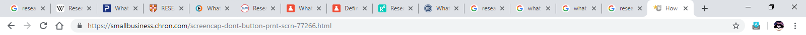
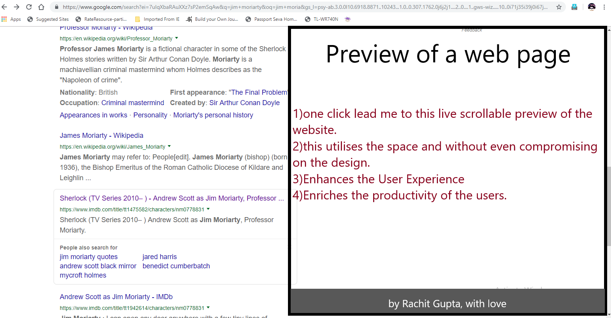

## Preview links before actually opening a new tab:

**Problem faced:**  
While researching on something or just finding documentations/tutorials/blogs while developing, we often find ourselves stuck in opening the 'search results' in a new tab. This leads to enormous no. of tabs in one browser which also affects our mental status and often leads to detoriated output of our work.
The user may not know immediately whether a given link is relevant to them or not.
 
the following image is an example of cluster of tabs due to no 'webpage preview feature'-
 

 
 

**Solution/Suggestion:** To aid them,On **ONE** left click, Queria(the search engine) will provide a live preview of the link on the right side of the search results, on **TWO** left clicks the link will open the webpage as normal.
 
following is an example design of preview-
 

